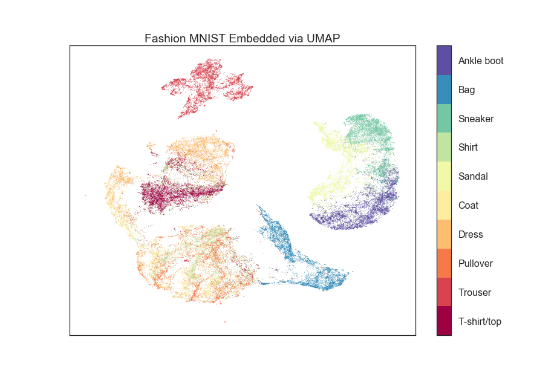

# Summary

Uniform Manifold Approximation and Projection (UMAP) is a dimension reduction technique
that can be used for  visualisation similarly to t-SNE, but also for general non-linear
dimension reduction. UMAP has a rigorous mathematical foundation, but is simple to use,
with a scikit-learn compatible API. UMAP is among the fastest manifold learning
implementations available -- signifcantly faster than most t-SNE implementations.

UMAP supports a number of useful features, including the ability to use labels
(or partial labels) for supervised (or semi-supervised) dimension reduction,
and the ability to transform new unseen data into a pretrained embedding space.

For details of the mathematical underpinnings see [@umap_arxiv].

-

# References
